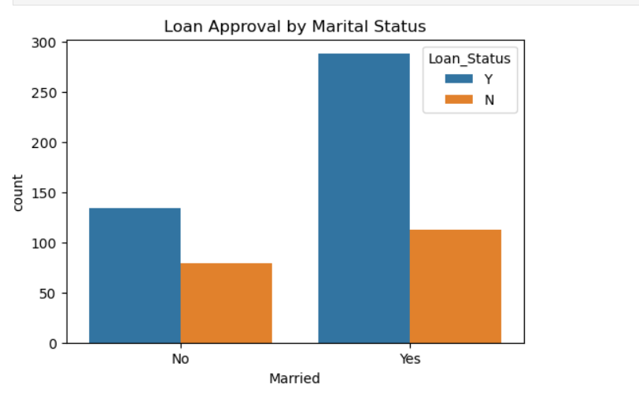
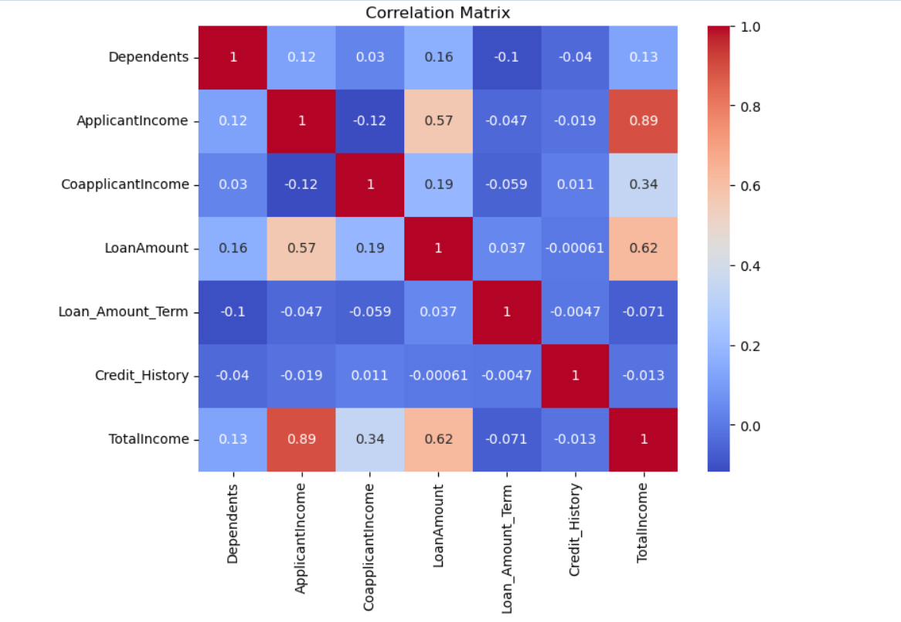
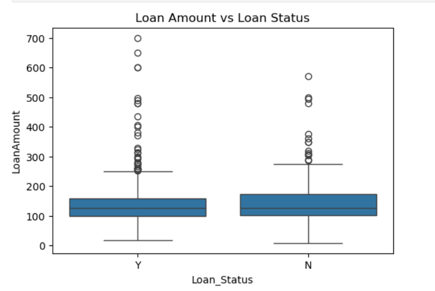
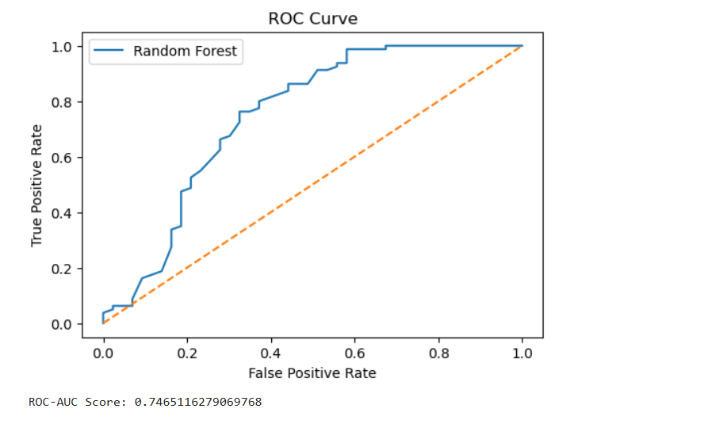

# Loan Approval Prediction using Machine Learning

This project builds a machine learning model to predict whether a loan application will be approved based on socio-economic and credit-related factors.

The workflow includes data preprocessing, exploratory data analysis (EDA), feature engineering, model training, and model evaluation. Multiple classification algorithms such as Logistic Regression, Decision Tree, Random Forest, and Support Vector Machine (SVM) are implemented and compared to identify the best-performing model.

The project demonstrates a complete machine learning pipeline using Python and Scikit-learn.

Tools and Libraries Used:
- Python
- Pandas
- NumPy
- Matplotlib
- Seaborn
- Scikit-learn
- Jupyter Notebook

## Visualizations

### Total Income Distribution

### Loan Approval by Marital Status

### Loan Approval by Education

### Loan Amount Distribution

### Correlation Heatmap

### Loan Amount vs Loan Status

### Confusion Matrix

### ROC Curve

