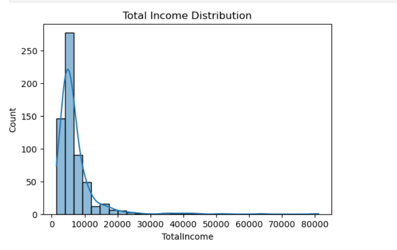
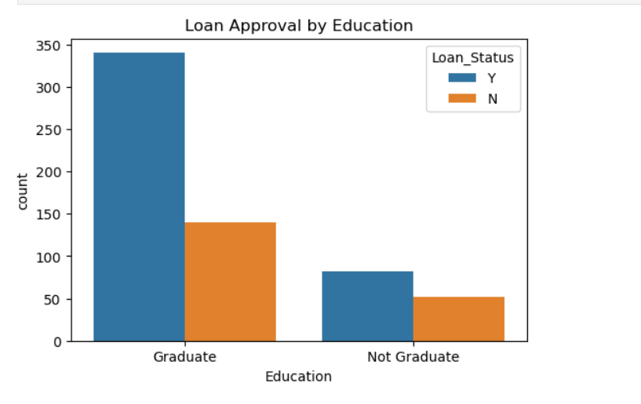
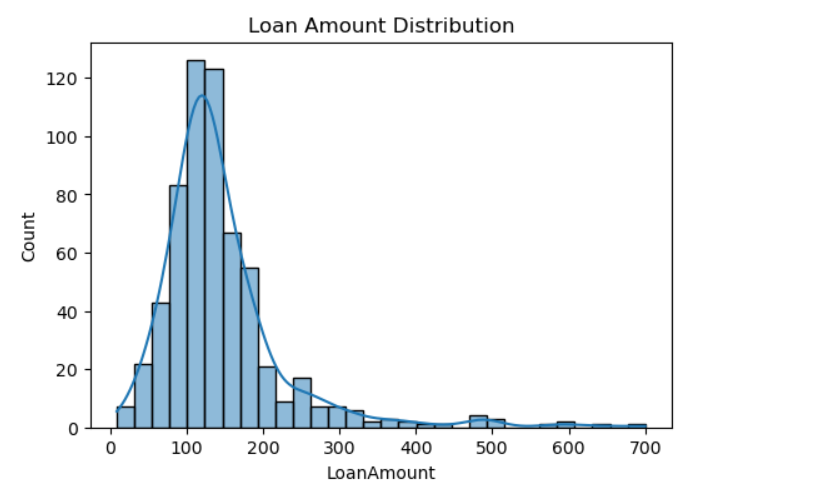
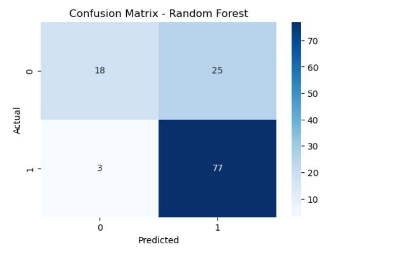

# Loan Approval Prediction using Machine Learning

This project builds a machine learning model to predict whether a loan application will be approved based on socio-economic and credit-related factors.

The workflow includes data preprocessing, exploratory data analysis (EDA), feature engineering, model training, and model evaluation. Multiple classification algorithms such as Logistic Regression, Decision Tree, Random Forest, and Support Vector Machine (SVM) are implemented and compared to identify the best-performing model.

The project demonstrates a complete machine learning pipeline using Python and Scikit-learn.

Tools and Libraries Used:
- Python
- Pandas
- NumPy
- Matplotlib
- Seaborn
- Scikit-learn
- Jupyter Notebook

## Visualizations

### Total Income Distribution


### Loan Approval by Marital Status


### Loan Approval by Education


### Loan Amount Distribution


### Correlation Heatmap


### Loan Amount vs Loan Status


### Confusion Matrix


### ROC Curve


## Dataset

The dataset used in this project is the **Loan Prediction Dataset from Kaggle**.

It contains **614 loan application records** and **13 features** describing demographic, financial, and credit-related attributes of applicants.

### Features in the Dataset

| Feature | Description |
|-------|-------------|
| Loan_ID | Unique loan application ID |
| Gender | Applicant gender |
| Married | Marital status |
| Dependents | Number of dependents |
| Education | Applicant education level |
| Self_Employed | Employment status |
| ApplicantIncome | Income of the applicant |
| CoapplicantIncome | Income of the co-applicant |
| LoanAmount | Loan amount requested |
| Loan_Amount_Term | Loan repayment period |
| Credit_History | Credit history of the applicant |
| Property_Area | Urban / Semi-Urban / Rural |
| Loan_Status | Target variable (Loan approved or not) |

Target Variable:

- **Y → Loan Approved**
- **N → Loan Rejected**

---

## Project Workflow

The project follows a structured **data science workflow**:

### 1. Data Loading and Exploration

- Loaded the dataset using **Pandas**
- Inspected dataset structure, shape, and data types
- Generated descriptive statistics
- Checked class distribution of loan approval

---

### 2. Data Cleaning and Preprocessing

Several preprocessing steps were performed:

- Removed unnecessary columns such as **Loan_ID**
- Handled missing values:
  - **Mode imputation** for categorical variables
  - **Median imputation** for numerical variables
- Converted categorical variables into numerical form using **Label Encoding**

---

### 3. Feature Engineering

A new feature was created to better represent the financial capacity of applicants.

```
TotalIncome = ApplicantIncome + CoapplicantIncome
```

This feature helps the model better capture the **combined household income of the applicant**.

---

### 4. Exploratory Data Analysis (EDA)

EDA was performed using **Matplotlib** and **Seaborn** to identify patterns in the dataset.

Key visualizations included:

- Loan approval distribution
- Approval rates by gender
- Approval rates by education level
- Loan approval by marital status
- Income distribution analysis
- Correlation heatmap for numerical features
- Boxplots for detecting outliers

These visualizations helped understand **relationships between applicant attributes and loan approval**.

---

### 5. Model Building

Multiple machine learning classification algorithms were implemented:

- **Logistic Regression**
- **Decision Tree**
- **Random Forest**
- **Support Vector Machine (SVM)**

The dataset was split into **training and testing sets** to evaluate model performance on unseen data.

---

### 6. Model Evaluation

Models were evaluated using multiple performance metrics:

- Accuracy
- Precision
- Recall
- F1 Score
- Confusion Matrix
- ROC-AUC Score
- ROC Curve

These metrics helped compare the performance of different classification algorithms.

---

### 7. Model Comparison

All models were compared based on their evaluation metrics to identify the **best-performing model for loan approval prediction**.

The model with the highest performance was selected as the final predictive model.

---

## Technologies and Libraries Used

**Programming Language**

- Python

**Libraries**

- Pandas
- NumPy
- Matplotlib
- Seaborn
- Scikit-learn

**Development Environment**

- Jupyter Notebook

---
